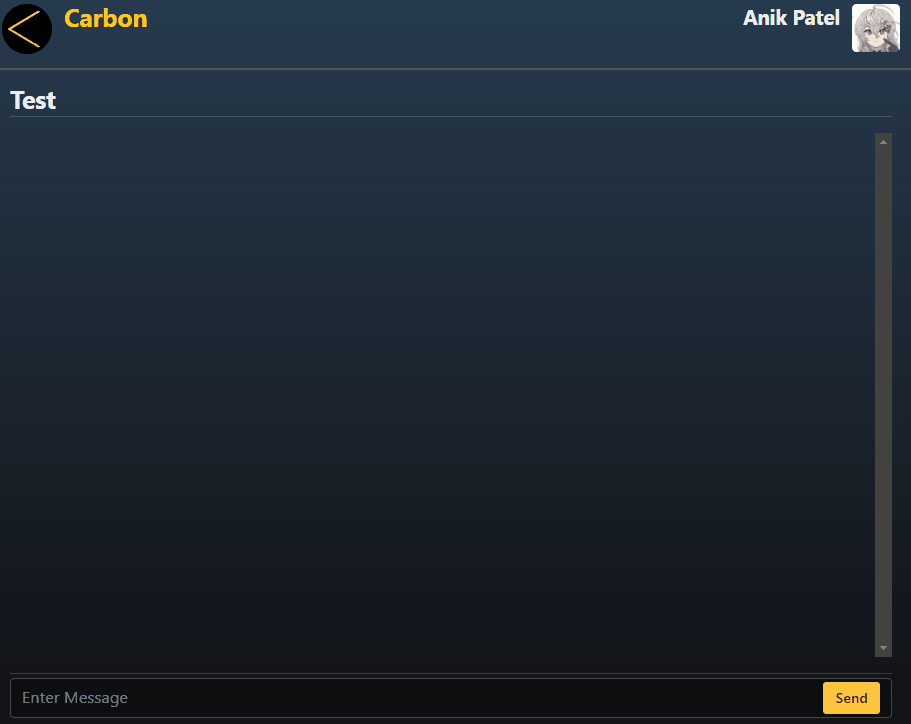

# Project Carbon

An alternative real time chat app

## Getting Started Dev

Install the npm dependencies with: `npm install`

Create a `.env` file based on the given sample

Then, run the development server: `npm run dev`

Open [http://localhost:3000](http://localhost:3000) with your browser to see the result

## Libraries used

- [Prisma ORM](https://www.prisma.io/)
- [Nextauth](https://next-auth.js.org/)
- [Zod](https://zod.dev/)
- [Radix UI](https://www.radix-ui.com/)
- [React Toastify](https://www.npmjs.com/package/react-toastify)

## Future Improvements

- [ ] Pagination and Infinite scrolling for messages in chat
- [ ] Popup mini-profile when clicking on sender image in chatwindow
- [ ] Admins being able to delete messages
- [ ] Reactions and Replies
